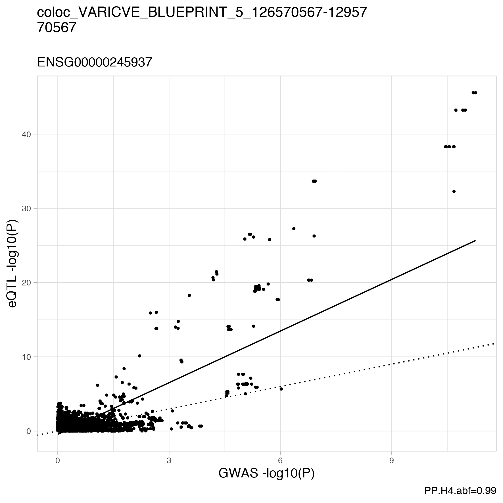

```{r setup, include=FALSE}
knitr::opts_chunk$set(echo = TRUE)
```

The code below shows how to use the coloc-wrapper using a simple example. 

See the [GitHub](https://github.com/EmiliaVartiainen/coloc-wrapper) repository on more information and how to get coloc-wrapper running. 

## Goal 

We want to perform colocalization for Varicose veins `I9_VARICVE` with all eQTLs in the region of gene *SLC12A2* (5:128070567). For eQTLs we have data from [BLUEPRINT study](http://www.ebi.ac.uk/eqtl/Studies/).

## Data and region choice

The question of **what datasets** and **which regions** to use for colocalization is a crucial one, as the choice affects colocalization. However, this is discussed [elsewhere]( https://doi.org/10.1371/journal.pgen.1008720
) and not the purpose of this example script. 

## Download the data

First, we need to download the data to where we are planning to run the coloc wrapper. 

Important: summary statistics needs to be tabixed!

### 1. GWAS from FinnGen

The GWAS summary statistics for varicose veins (`I9_VARICVE`) is publicly available for data release 3. For access see https://www.finngen.fi/en/access_results.  

### 2. eQTL from the eQTL catalogue 

To download the BLUEPRINT eQTL summary statistics for monocyte tissue, we can use the wget command. 

```
wget ftp://ftp.ebi.ac.uk/pub/databases/spot/eQTL/csv/BLUEPRINT/ge/BLUEPRINT_ge_monocyte.all.tsv.gz
wget ftp://ftp.ebi.ac.uk/pub/databases/spot/eQTL/csv/BLUEPRINT/ge/BLUEPRINT_ge_monocyte.all.tsv.gz.tbi
```

## Specify the parameters
To run coloc, we need to set a couple of parameters. 

- Our region of interest is `5:126,570,567-129,570,567` (the variant we are focussing on is `5:128070567`, but we add a buffer window 1.5 Mb to the left and right hand side).
- Sample size for the eQTL dataset can be found [here](https://www.ebi.ac.uk/eqtl/Studies/). 
- Number of cases and controls for the FinnGen GWAS data can be found in the same place as the GWAS data itself (look for `finngen_*pheno_n.tsv`).


## Trimming the data
First, GWAS and eQTL summary statistics need to be trimmed to the region of interest. 

- `file`: GWAS or eQTL file path or url
- `region`: genomic region of interest, format `chr:start-end`
- `out`: output file 

### 1. GWAS
```
Rscript extdata/step1_subset_data.R	\
	 --file=I9_VARICVE.gz\
	 --region="5:126570567-129570567" \
   --out=finngen_R3_I9_VARICVE_5_126570567-129570567.txt
```

eQTL dataset has the variant identifier in the format `chr#_chrom_pos_alt_ref`

```
cat finngen_R3_I9_VARICVE_5_126570567-129570567.txt | awk '{print "chr"$1"_"$2"_"$3"_"$4"\t"$0}'  > tmp && mv tmp finngen_R3_I9_VARICVE_5_126570567-129570567.txt
```

### 2. eQTL
```
Rscript extdata/step1_subset_data.R	\
	 --file=BLUEPRINT_ge_monocyte.all.tsv.gz\
	 --region="5:126570567-129570567" \
   --out=BLUEPRINT_ge_monocyte_5_126570567-129570567.txt
```


## Running coloc

To run the colocalization, pass on the trimmed datasets.

- `gwas`: GWAS summary statistics file for one region
- `eqtl`: eQTL summary statistics file for one region
- `header_gwas`: header of GWAS file, named vector in quotes
- `header_eqtl`: header of eQTL file, named vector in quotes
- `info_gwas`: options for GWAS dataset, more info [here](https://www.rdocumentation.org/packages/coloc/versions/3.2-1/topics/coloc.abf)
    - `type`: the type of data in dataset - either "quant" or "cc" to denote quantitative or case-control
    - `s`: for a case control dataset, the proportion of samples in dataset that are cases
    - `N`: number of samples in the dataset
- `info_eqtl`: options for eQTL dataset, more info [here](https://www.rdocumentation.org/packages/coloc/versions/3.2-1/topics/coloc.abf)
    - `type`: the type of data in dataset - either "quant" or "cc" to denote quantitative or case-control
    - `sdY`: for a quantitative trait, the population standard deviation of the trait. if not given, it can be estimated from the vectors of varbeta and MAF
    - `N`: number of samples in the dataset
- `p1`: the prior probability that any random SNP in the region is associated with exactly trait 1
- `p2`: the prior probability that any random SNP in the region is associated with exactly trait 2
- `p12`: the prior probability that any random SNP in the region is associated with both traits
- `locuscompare_thresh`: PP4 threshold that plots the locuscompare plots
- `out`: output file

```
Rscript extdata/step2_run_coloc.R	\
  --gwas="finngen_R3_I9_VARICVE_5_126570567-129570567.txt" \
	--eqtl="BLUEPRINT_ge_monocyte_5_126570567-129570567.txt" \
	--header_gwas="c(varid = 'chr#chrom_pos_ref_alt', pvalues = 'pval', MAF = 'maf')" \
	--header_eqtl="c(varid = 'variant', pvalues = 'pvalue', MAF = 'maf', gene_id = 'molecular_trait_id')" \
	--info_gwas="list(type = 'cc', s = 20425/(20425+225735), N  = 20425+225735)" \
	--info_eqtl="list(type = 'quant', sdY = 1, N = 554)" \
	--p1=1e-4 \
	--p2=1e-4 \
	--p12=5e-6 \
	--locuscompare_thresh=0.7 \
	--out="coloc_VARICVE_BLUEPRINT_5_126570567-129570567.txt" \
```

## Evaluating the results

The coloc wrapper returns two pieces per input file: 

1. colocalization results per gene
2. locuscompare plot per gene (depending on the `locuscompare_thresh` parameter)

### Coloc results
Columns:

- `gene`: gene ID
- `nsnps`: number of SNPs analysed
- `PP.H0.abf`: posterior probabilitiy of H0 (no causal variant)
- `PP.H1.abf`: posterior probability of H1 (causal variant for trait 1 only)
- `PP.H2.abf`: posterior probability of H2 (causal variant for trait 2 only)
- `PP.H3.abf`: posterior probability of H3 (two distinct causal variants)
- `PP.H4.abf`: posterior probability of H4 (one common causal variant)

```{r, echo=FALSE}
library(DT)
coloc_results <- data.table::fread("coloc_VARICVE_BLUEPRINT_5_126570567-129570567.txt", sep = "\t")
coloc_results$PP.H0.abf <- round(coloc_results$PP.H0.abf, 4)
coloc_results$PP.H1.abf <- round(coloc_results$PP.H1.abf, 4)
coloc_results$PP.H2.abf <- round(coloc_results$PP.H2.abf, 4)
coloc_results$PP.H3.abf <- round(coloc_results$PP.H3.abf, 4)
coloc_results$PP.H4.abf <- round(coloc_results$PP.H4.abf, 4)
datatable(coloc_results)
```

### Locuscompare plot

```{r, echo=FALSE, out.width = "80%", fig.align = "center"}
library(knitr)

```


